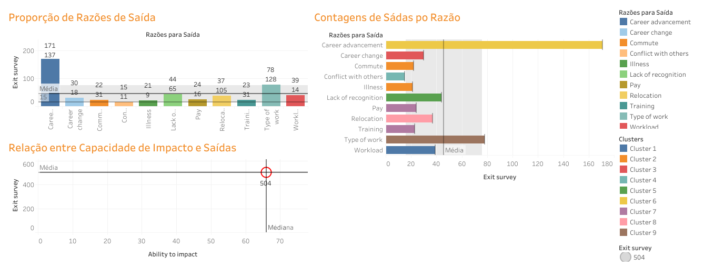

## Descrição do Projeto

O projeto se concentra na análise de dados relacionados às razões de saída de funcionários da empresa, com foco em entender as categorias de motivos de saída, suas frequências e como eles impactam a organização. Além disso, busca-se propor soluções e ações para lidar com esses problemas e melhorar a retenção de funcionários.

## Estrutura do Projeto

## Contexto

Neste projeto, fui contratado como analista de dados pelo Chief Marketing Officer (CMO) para trabalhar em conjunto com o Parceiro de Negócios de Recursos Humanos (HRBP). O objetivo principal era entender as razões por trás do atrito de funcionários - pessoas deixando a empresa - em toda a organização de marketing e apresentar descobertas e soluções.

## Como Fazer

Para atingir os objetivos do projeto, foram seguidas as seguintes etapas:

1. **Importação e Preparação de Dados**: Os dados foram importados do [conjunto de dados fornecido](https://raw.githubusercontent.com/julianapvh/projeto_individual_modulo_05/main/data/dados_tratados.csv) e passaram por processos de limpeza e modelagem, conforme necessário.

2. **Análise Exploratória**: Foi realizada uma análise exploratória dos dados, incluindo o uso de gráficos, métricas estatísticas e técnicas de visualização.

3. **Criação de Visualizações**: Utilizei recursos gráficos e de visualização do Tableau para criar visualizações interativas que representam os dados de forma clara e informativa.

4. **Criação de Dashboards**: Foram criados painéis de controle (dashboards) para acompanhar métricas-chave e identificar insights relevantes.

5. **Narrativa dos Dados**: Uma narrativa clara e concisa foi criada para contar a história dos dados e fornecer recomendações e conclusões baseadas nas análises realizadas.

## Estrutura do Projeto

- O arquivo `analise_dados_tableau.twbx` contém o projeto Tableau com as visualizações e o dashboard criados.

- O arquivo `projeto_individual_modulo_05.ipynb` contém o código Python usado para importar e preparar os dados, bem como criar o gráfico inicial.

## Visualizações Principais

- **Dasboard**
  

## Conclusão

Neste projeto, exploramos profundamente os dados relacionados às razões pelas quais os funcionários estão deixando nossa organização de marketing. Com base em análises sólidas, identificamos razões críticas de saída e fornecemos recomendações fundamentadas para melhorar a retenção de talentos e o ambiente de trabalho.

