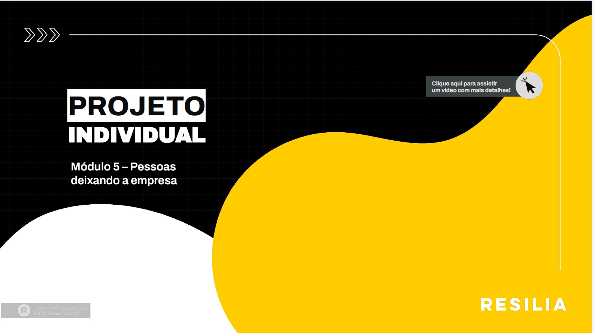

# Análise de Razões de Saída de Funcionários - Projeto com Tableau

Este repositório contém o projeto de análise de razões de saída de funcionários, realizado com o uso da ferramenta Tableau. O objetivo deste projeto é identificar as principais razões pelas quais os funcionários estão deixando a empresa, analisar seus impactos e sugerir possíveis soluções com base nos insights obtidos.

## Descrição do Projeto

O projeto se concentra na análise de dados relacionados às razões de saída de funcionários da empresa, com foco em entender as categorias de motivos de saída, suas frequências e como eles impactam a organização. Além disso, busca-se propor soluções e ações para lidar com esses problemas e melhorar a retenção de funcionários.

## Estrutura do Projeto

O projeto está estruturado da seguinte maneira:

- `data`: Contém o conjunto de dados utilizado para a análise.
- `notebooks`: Contém os notebooks utilizados para limpeza, análise exploratória e criação das visualizações no Tableau.
- `visualizations`: Inclui as capturas de tela das visualizações criadas no Tableau.
- `presentation`: Contém a apresentação final do projeto, incluindo os principais insights, conclusões e recomendações.

## Passos Realizados

1. **Exploração e Planejamento**: Leitura e compreensão da descrição do projeto, do conjunto de dados e do objetivo da análise.

2. **Preparação dos Dados**: Importação dos dados no Tableau, limpeza e formatação necessárias.

3. **Análise Exploratória**: Exploração das diferentes categorias de razões de saída e suas relações.

4. **Criação de Visualizações**: Criação de gráficos de barras, gráficos de bolhas e gráficos de pizza no Tableau.

5. **Identificação de Insights**: Identificação de insights relevantes sobre as razões de saída e seus impactos.

6. **Sugestão de Soluções**: Proposição de possíveis soluções para lidar com as razões de saída identificadas.

7. **Criação de Dashboard**: Criação de um painel de controle no Tableau com visualizações interativas.

8. **Preparação de Narrativa**: Elaboração de uma narrativa clara e concisa que conta a história dos dados.

9. **Documentação e Entrega**: Documentação de todo o processo e preparação da apresentação final.

## Visualizações

As visualizações criadas no Tableau estão disponíveis na pasta `visualizations` deste repositório.

## Apresentação

A apresentação final do projeto, incluindo os principais insights, conclusões e recomendações, está disponível na pasta `presentation`.

## Como Utilizar

1. Clone este repositório para sua máquina local.
2. Explore os notebooks na pasta `notebooks` para entender as etapas de análise.
3. Visualize as capturas de tela das visualizações na pasta `visualizations`.
4. Leia a apresentação final na pasta `presentation`.

Este projeto foi realizado como parte do projeto de análise de dados usando o Tableau para compreender as razões de saída de funcionários da empresa e propor soluções relevantes.
